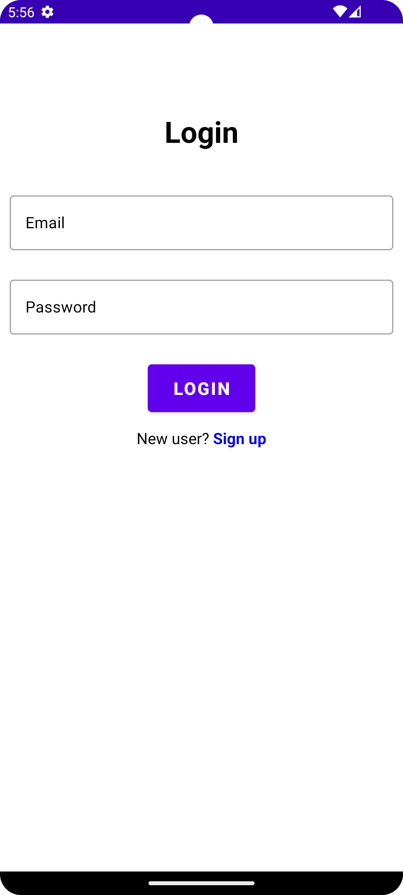
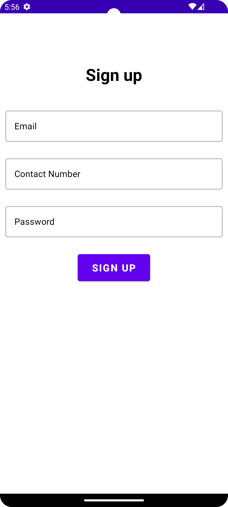
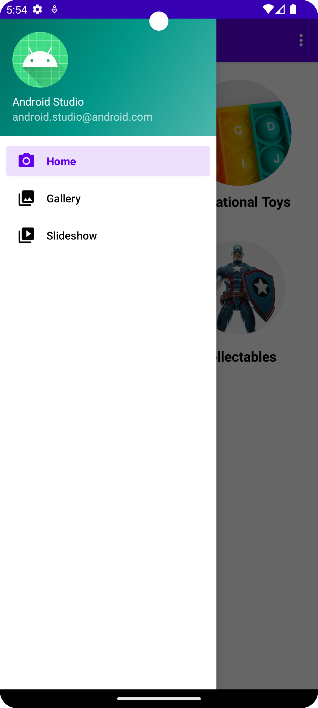
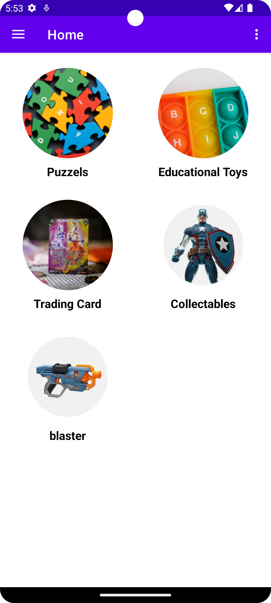
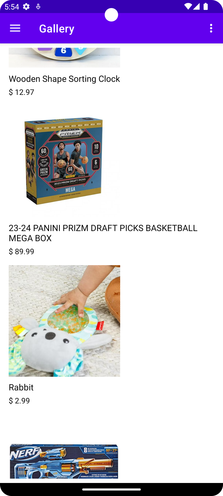
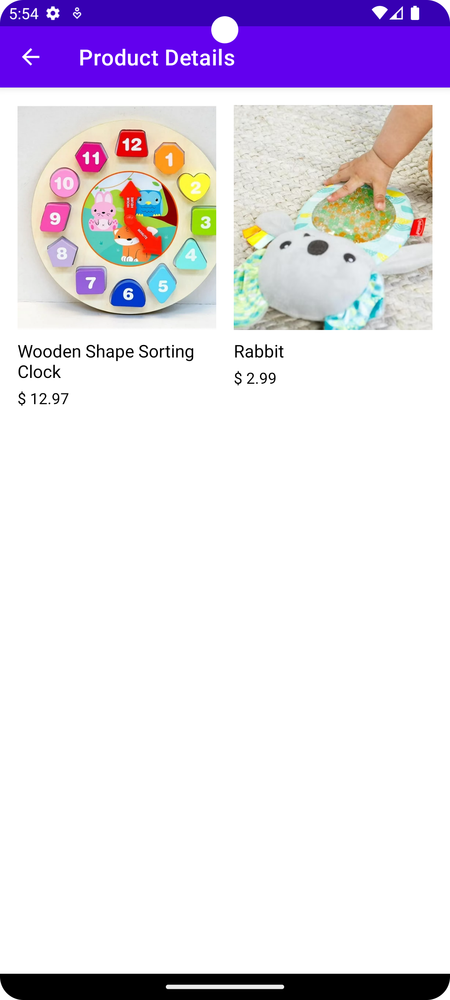
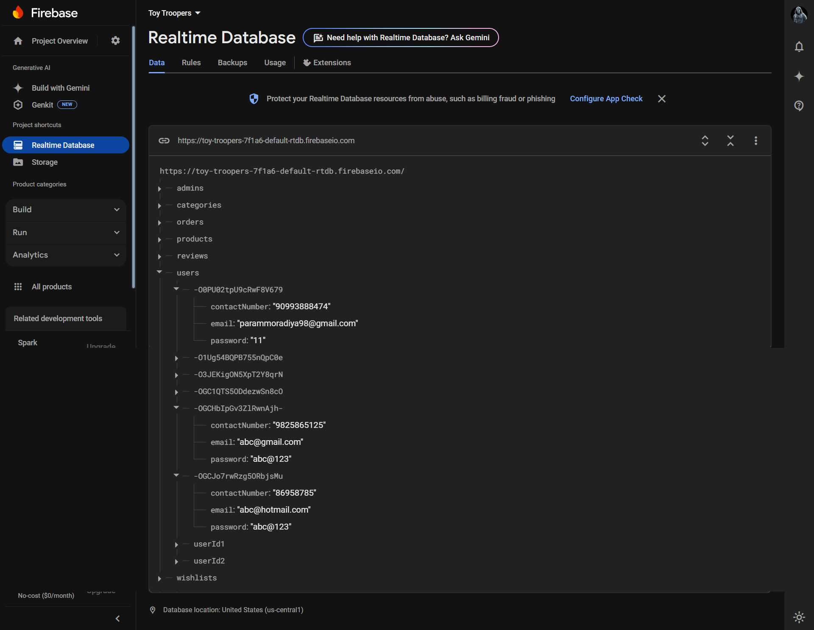

# Toy Troopers - Client Mobile Application

## Project Overview
The **Toy Troopers Client Mobile Application** is a feature-rich Android app that serves as the front-end interface for users to browse, filter, and purchase toys from the Toy Troopers store. This app is built using Android's modern development tools and integrates seamlessly with Firebase for authentication and real-time database functionality.

---

## Features
- **User Authentication:** Sign up and log in securely with Firebase Authentication.
- **Browse Products:** View toy categories and products with detailed descriptions.
- **Product Filtering:** Navigate by categories to find specific toys.
- **Dynamic UI:** Interactive UI with adaptive layouts for different screen sizes.

---

## Screenshots
### Login and Signup



### Home and Categories



### Product List and Details




---

## Demo Video
Click below to watch a short demo:


---

## Folder Structure
```plaintext
Rutwik-Kikani-Toy_Troopers/
├── build.gradle.kts
├── gradle.properties
├── gradlew
├── settings.gradle.kts
├── app/
│   ├── build.gradle.kts
│   ├── google-services.json
│   ├── src/
│       ├── main/
│       │   ├── AndroidManifest.xml
│       │   ├── java/com/example/toytroopers/
│       │   │   ├── activity/
│       │   │   ├── adapter/
│       │   │   ├── model/
│       │   │   └── utils/
│       │   └── res/
│       │       ├── layout/
│       │       ├── values/
│       │       ├── drawable/
│       │       └── navigation/
├── gradle/
└── gradlew.bat
```
---

## Setup Instructions
1. Clone the repository:
   ```bash
   git clone https://github.com/username/toy-troopers-client.git
   cd toy-troopers-client
   ```
2. Open the project in Android Studio.
3. Sync the project with Gradle files.
4. Add your Firebase `google-services.json` file under the `app/` directory.
5. Run the app on an emulator or physical device.

---

## Technologies Used
- **Programming Language:** Java
- **Backend:** Firebase Realtime Database, Firebase Authentication
- **UI Framework:** Android Views and XML
- **Tools:** Android Studio, Gradle

---

## Contributors
- **Rutwik Kikani** ([GitHub](https://github.com/Rutwik-Kikani))

---

### License
This project is licensed under the MIT License. See the LICENSE file for details.
